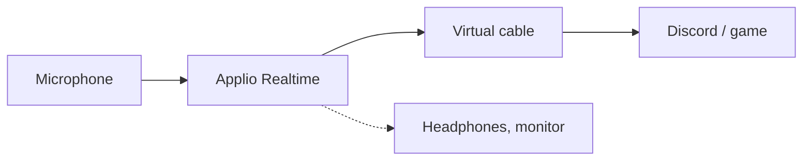

# voice-changer

[Русский](README.md) | English

Real-time voice changing for Discord and games, built on [Applio](https://github.com/IAHispano/Applio) 3.6.5 (RVC). Applio itself is not in this repo: the installer downloads the official build, patches four bugs in its realtime engine and adds a ready-made female Russian voice model. The rest is scripts for picking a pitch, training your own model and finding out why the audio breaks up.



## How it sounds

Listen to "before" and "after" on the [page with a player](https://friskes.github.io/voice-changer/): GitHub doesn't play audio in a README.

| Recording | File | Average pitch |
| --- | --- | --- |
| Before | [before.mp3](docs/before.mp3) | 160 Hz |
| After | [after.mp3](docs/after.mp3) | 268 Hz |

"After" comes from the realtime engine, not from ordinary file conversion: the recording goes through in 100 ms blocks, as in a live call, with the `ru-masha-200` model and this repo's default settings. Only Pitch differs: +9 instead of +14, because the speaker's voice is higher than mine. The command: `tool stream_sim --src before.wav --pitch 9`. After the engine the recording was only trimmed and encoded to mp3; volume and timbre were not touched. The source is a studio line by the actor Dima from the [Dialogs](https://huggingface.co/datasets/langswap/dialogs-ru-emotional-conversations) corpus (OpenRAIL), file `masha_dima_part8_166.wav`, with silence trimmed and loudness levelled; both mp3 files are covered by the [corpus license](model/LICENSE-Dialogs-OpenRAIL.md).

What not to expect. In realtime some consonants come out worse than when the same file is converted offline: to render a soft Russian "s" cleanly, for instance, the model needs to hear about 0.3 s of what follows, and a live stream gives it 0.1–0.2 s. Now and then an "s" sounds like "shch". The sample phrase was picked among those where this doesn't happen. Output quality also follows the input: a cheap microphone in a noisy room will sound worse. For dropouts and distortion in games see [When the audio breaks up](#when-the-audio-breaks-up).

## What is fixed in Applio

The first three bugs showed up in live calls with a game running; the changes are in [patches/01-realtime-fixes.patch](patches/01-realtime-fixes.patch). The fourth turned up while preparing the sample above and lives in [patches/03-realtime-lookahead.patch](patches/03-realtime-lookahead.patch).

| File | Before | After |
| --- | --- | --- |
| `rvc/realtime/core.py` | Output was multiplied by the input level: speech came out 20–30 dB quieter and quiet syllables vanished | A gate: silence is muted, speech passes at full volume |
| `rvc/realtime/audio.py` | Main output and monitor read from one queue and took blocks from each other; after the input stopped, the callback hung and the Stop button did nothing | A separate queue for the main output, reads time out after 1 s |
| `rvc/realtime/callbacks.py` | When the GPU was late, the previous block was replayed, so the listener heard words several times | Waits for the result up to 60% of the block length, then outputs silence |
| `rvc/realtime/core.py` | The audio sent out was the very edge of the processed chunk, where the model had not yet heard what follows: consonants got smeared | A 50 ms margin: the output is taken a little further from the edge. Latency grew by 50 ms; recognized-phoneme errors over 12 lines went from 21% to 19% |

The second patch, [02-realtime-defaults.patch](patches/02-realtime-defaults.patch), changes slider defaults. Applio only remembers devices and the model between launches, so everything else would have to be set again every time.

| Setting | Applio | Here |
| --- | --- | --- |
| Pitch | 0 | 14 |
| Search Feature Ratio | 0 | 0.75 |
| Volume Envelope | 1 | 0 |
| Protect Voiceless Consonants | 0.33 | 0.5 |
| Chunk Size | 250 ms | 100 ms |

`Extra Conversion Size` stays at Applio's 2.5 s, and lowering it is a bad idea. It is how much audio before the current block the model hears; at 0.5 s recognized-phoneme errors are 27% against 21%, while the block processing time on an RTX 5070 Ti is the same, 33–34 ms.

Pitch 14 was picked for my voice; 12 is exactly one octave up, male to female. `record-my-voice.bat` (below) suggests a value for yours. To make it the default, change `value=14` in the patch before installing, or in `Applio/tabs/realtime/realtime.py` afterwards.

The same patch pre-ticks the checkbox that accepts [Applio's terms of use](https://github.com/IAHispano/Applio/blob/main/TERMS_OF_USE.md) on the Realtime tab, so it doesn't have to be clicked on every launch. By installing this build you accept those terms. If you don't, remove the first hunk from the patch.

## Requirements

- Windows 10 or 11 and an NVIDIA GPU. Tested on an RTX 5070 Ti 16 GB, driver 616.56.
- 15 GB of disk space: the Applio archive is 4.6 GB and unpacks to 7 GB. Training needs about 5 GB more.
- A virtual audio cable: [VB-CABLE](https://vb-audio.com/Cable/) (free) or [Virtual Audio Cable](https://vac.muzychenko.net/en/) (paid). I use the latter; the scripts handle both.

## Install

```bat
git clone https://github.com/Friskes/voice-changer.git C:\voice-changer
cd /d C:\voice-changer
install.bat
```

Keep the path short: the longest path inside Applio is 141 characters, and Windows limits a full path to 260 by default.

`install.bat` downloads `ApplioV3.6.5.zip` from [Applio's HuggingFace page](https://huggingface.co/IAHispano/Applio/tree/main/Compiled/Windows), checks its SHA256, unpacks it into `Applio\` and applies the patches, then downloads the voice model from the [release](https://github.com/Friskes/voice-changer/releases). Originals of the patched files stay next to them as `.orig`. If you already have the Applio archive: `install.bat -ApplioZip D:\path\ApplioV3.6.5.zip`. To skip the model: `install.bat -NoModel`. Running it again is safe. To undo the patches: `tool apply_patches --revert`.

## Voice model

The installer puts `ru-masha-200` (440 MB) into `Applio\logs\ru-masha-200\`: a female Russian voice trained on the Dialogs corpus. Training details and licensing are in [model/README.md](model/README.md). The corpus's [OpenRAIL license](model/LICENSE-Dialogs-OpenRAIL.md) applies to the model: free to use, commercially too, within the restrictions of its Section 2.

Any other RVC v2 model works as well: put its `.pth` and `.index` into `Applio\logs\<name>\`.

Or train one:

```bat
train-voice.bat M ru-masha 200
```

Arguments: speaker (`M` or `S`), model name, epochs. The script takes 45 minutes of one actress from the Russian [Dialogs](https://huggingface.co/datasets/langswap/dialogs-ru-emotional-conversations) corpus (OpenRAIL license), downloads the [SnowieV3.1](https://huggingface.co/MUSTAR/SnowieV3.1-40k) pretrain (1.2 GB, SHA256-checked) and runs Applio training. 200 epochs took about two hours on an RTX 5070 Ti. Progress goes to `logs\train-<name>.log`, the model ends up in `Applio\logs\<name>\`. With less than 16 GB of VRAM, lower `BATCH` in [tools/train_voice.py](tools/train_voice.py).

## Run

1. `run.bat` opens `http://127.0.0.1:6969` in the browser.
2. Realtime tab: input is your microphone, output is the virtual cable, monitor is your headphones (optional). Pick the `ru-masha-200` model and press Start.
3. In Discord or the game, select the recording side of the same cable as the microphone: `CABLE Output` for VB-CABLE, the same-named `Line 1` for Virtual Audio Cable.

If Applio hangs, `stop-applio.bat` kills it.

## Picking the pitch

`record-my-voice.bat` records 30 seconds from the microphone into `logs\refs\my_voice.wav`, measures your average pitch and prints which Pitch value gets you to 235 Hz (a typical female voice) and 255 Hz (higher). The tests below reuse this recording. The phrases it asks you to read are Russian; any speech will do.

## When the audio breaks up

In a game the voice may cut out or distort. The game and Applio share one GPU, and when the game takes all of it, a block doesn't get processed within its 100 ms. Tested on an RTX 5070 Ti only; weaker cards have less headroom. What helps: cap the FPS or lower the graphics so the GPU has room to breathe, or raise `Chunk Size`, which gives each block more time at the cost of latency. `tool battle_monitor` from the table below shows the share of dropouts and the GPU load at those moments.

The scripts take devices and the model from Applio's config, i.e. whatever is selected on the Realtime tab. Override with environment variables holding part of a device name: `VC_MIC`, `VC_CABLE`, `VC_HEADPHONES`, `VC_VIRTUAL_MIC`.

| Command | What it shows |
| --- | --- |
| `probe.bat` | 10 seconds of microphone and cable levels side by side, in 0.1 s steps. Shows where the output is silent while you talk |
| `tool battle_monitor 180` | The same over 3 minutes of actual play: share of dropouts, latency, GPU load at the moments of dropouts |
| `tool stream_sim` | Runs a recording through the engine with no audio devices: share of quiet windows in the input and in the output, inference time. Many more quiet windows in the output: blame the model or settings; numbers close: look at the devices. See `--help` |
| `tool live_loop_test` | The whole path with no human. Needs a second virtual cable (`VC_VIRTUAL_MIC`); stop Applio first |
| `tool my_voice_pitch` | Converts your recording at Pitch +10 to +16 and estimates how female and how old each result sounds |
| `tool make_audition <folder>` | A listening reel plus the same estimates for candidate voices; one subfolder per candidate |
| `tools\endpoint_volumes.ps1` | System volume and mute state of every audio device |

On first run `my_voice_pitch` and `make_audition` download the [audeering age-gender](https://huggingface.co/audeering/wav2vec2-large-robust-24-ft-age-gender) model (1.2 GB, CC BY-NC-SA 4.0, non-commercial use only).

Script output is in Russian.

## Security

- Model files (`.pth`) are Python pickles: loading one can run arbitrary code. Only use models from sources you trust. The Applio archive, the release model and the pretrain are checked against SHA256 hashes pinned in [install.ps1](install.ps1) and [tools/train_voice.py](tools/train_voice.py).
- Applio listens on `127.0.0.1` only. Don't start it with `--share` and don't change `--server-name`: the UI has no password.
- Applio, models, datasets and voice recordings never get into git: [.gitignore](.gitignore) is a whitelist.

## Responsible use

[Applio's terms of use](https://github.com/IAHispano/Applio/blob/main/TERMS_OF_USE.md) and the restrictions of the [model license](model/LICENSE-Dialogs-OpenRAIL.md) apply. Don't impersonate a real person, and don't train a model on someone's voice without their consent.

## License

Code: [MIT](LICENSE). The patches modify Applio code, which is also [MIT](https://github.com/IAHispano/Applio/blob/main/LICENSE), © AI Hispano. The model in the release: [OpenRAIL](model/LICENSE-Dialogs-OpenRAIL.md).
