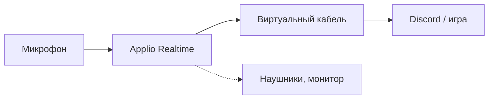

# voice-changer

[English](README.md) | Русский

Смена голоса в реальном времени для Discord и игр на базе [Applio](https://github.com/IAHispano/Applio) 3.6.5 (RVC). Сам Applio в репозиторий не входит: установщик скачивает официальную сборку, накладывает на неё три исправления realtime-движка и ставит готовую модель женского русского голоса. Рядом лежат скрипты для подбора тона, обучения своей модели и поиска причин, по которым звук рвётся.



## Что исправлено в Applio

Все три проблемы проявлялись в живом разговоре при запущенной игре. Правки лежат в [patches/01-realtime-fixes.patch](patches/01-realtime-fixes.patch).

| Файл | Было | Стало |
| --- | --- | --- |
| `rvc/realtime/core.py` | Выход умножался на громкость входа: речь получалась тише на 20–30 дБ, тихие слоги пропадали | Гейт: тишина глушится, речь идёт на полной громкости |
| `rvc/realtime/audio.py` | Основной выход и монитор читали одну очередь и забирали блоки друг у друга; после остановки входа колбэк зависал, кнопка «Стоп» не срабатывала | Отдельная очередь на основной выход, чтение с таймаутом 1 с |
| `rvc/realtime/callbacks.py` | Если видеокарта не успевала, повторялся прошлый блок — собеседник слышал слова по нескольку раз | Результат ждём до 60% длины блока, дальше отдаём тишину |

Второй патч, [02-realtime-defaults.patch](patches/02-realtime-defaults.patch), меняет значения ползунков по умолчанию. Applio запоминает между запусками только устройства и модель, остальное каждый раз пришлось бы выставлять заново.

| Настройка | Applio | Здесь |
| --- | --- | --- |
| Pitch | 0 | 14 |
| Search Feature Ratio | 0 | 0.75 |
| Volume Envelope | 1 | 0 |
| Protect Voiceless Consonants | 0.33 | 0.5 |
| Chunk Size | 250 мс | 100 мс |
| Extra Conversion Size | 2.5 с | 0.5 с |

Pitch 14 подобран под мой голос; 12 — ровно октава вверх, из мужского в женский. Свой Pitch подбирается скриптом `record-my-voice.bat` (ниже). Чтобы он стал значением по умолчанию, поправь `value=14` в патче до установки или в `Applio/tabs/realtime/realtime.py` после неё.

Тот же патч заранее ставит галочку согласия с [условиями использования Applio](https://github.com/IAHispano/Applio/blob/main/TERMS_OF_USE.md) во вкладке Realtime, чтобы не нажимать её при каждом запуске. Устанавливая эту сборку, ты принимаешь эти условия. Не согласен — убери из патча первый блок.

## Что нужно

- Windows 10 или 11, видеокарта NVIDIA. Проверено на RTX 5070 Ti 16 ГБ, драйвер 616.56.
- 15 ГБ на диске: архив Applio 4,6 ГБ плюс 7 ГБ после распаковки. Для обучения — ещё около 5 ГБ.
- Виртуальный аудиокабель: [VB-CABLE](https://vb-audio.com/Cable/) (бесплатный) или [Virtual Audio Cable](https://vac.muzychenko.net/en/) (платный). Я пользуюсь вторым, скрипты понимают оба.

## Установка

```bat
git clone https://github.com/Friskes/voice-changer.git C:\voice-changer
cd /d C:\voice-changer
install.bat
```

Клади репозиторий в короткий путь: самый длинный путь внутри Applio — 141 символ, а Windows по умолчанию ограничивает полный путь 260 символами.

`install.bat` скачивает `ApplioV3.6.5.zip` с [HuggingFace-страницы Applio](https://huggingface.co/IAHispano/Applio/tree/main/Compiled/Windows), сверяет SHA256, распаковывает в `Applio\` и накладывает патчи, затем качает модель голоса из [релиза](https://github.com/Friskes/voice-changer/releases). Оригиналы изменённых файлов остаются рядом с расширением `.orig`. Если архив Applio уже скачан: `install.bat -ApplioZip D:\путь\ApplioV3.6.5.zip`. Без модели: `install.bat -NoModel`. Повторный запуск ничего не ломает. Откатить патчи: `tool apply_patches --revert`.

## Модель голоса

Установщик кладёт в `Applio\logs\ru-masha-200\` модель `ru-masha-200` (440 МБ) — женский русский голос, обученный на корпусе Dialogs. Параметры обучения и лицензия описаны в [model/README.md](model/README.md). На модель действует [лицензия OpenRAIL](model/LICENSE-Dialogs-OpenRAIL.md) корпуса: пользоваться можно свободно, в том числе коммерчески, но с ограничениями из её раздела 2.

Подойдёт и любая другая модель RVC v2: положи `.pth` и `.index` в `Applio\logs\<имя>\`.

Либо обучи свою:

```bat
train-voice.bat M ru-masha 200
```

Аргументы: актриса (`M` или `S`), имя модели, число эпох. Скрипт берёт 45 минут речи одной актрисы из корпуса [Dialogs](https://huggingface.co/datasets/langswap/dialogs-ru-emotional-conversations) (лицензия OpenRAIL), качает претрейн [SnowieV3.1](https://huggingface.co/MUSTAR/SnowieV3.1-40k) (1,2 ГБ, с проверкой SHA256) и запускает обучение Applio. 200 эпох на RTX 5070 Ti заняли около двух часов. Ход пишется в `logs\train-<имя>.log`, готовая модель появляется в `Applio\logs\<имя>\`. Если видеопамяти меньше 16 ГБ, уменьши `BATCH` в [tools/train_voice.py](tools/train_voice.py).

## Запуск

1. `run.bat` — в браузере откроется `http://127.0.0.1:6969`.
2. Вкладка Realtime: вход — микрофон, выход — виртуальный кабель, монитор — наушники (по желанию). Выбери модель `ru-masha-200` и нажми «Старт».
3. В Discord или в игре выбери микрофоном записывающую сторону того же кабеля: у VB-CABLE это `CABLE Output`, у Virtual Audio Cable — одноимённая `Line 1`.

Остановить зависший Applio — `stop-applio.bat`.

## Подбор тона

`record-my-voice.bat` пишет 30 секунд с микрофона в `logs\refs\my_voice.wav`, измеряет твой средний тон и печатает, какой Pitch даст 235 Гц (обычный женский голос) и 255 Гц (повыше). Эту же запись используют тесты ниже.

## Если звук рвётся

Устройства и модель скрипты берут из конфига Applio — то, что выбрано во вкладке Realtime. Переопределить можно переменными окружения с частью имени устройства: `VC_MIC`, `VC_CABLE`, `VC_HEADPHONES`, `VC_VIRTUAL_MIC`.

| Команда | Что показывает |
| --- | --- |
| `probe.bat` | 10 секунд: уровни микрофона и кабеля рядом, по 0,1 с. Видно, где на выходе тишина, пока ты говоришь |
| `tool battle_monitor 180` | То же на 3 минутах во время игры: доля провалов, задержка, загрузка видеокарты в моменты провалов |
| `tool stream_sim` | Прогон записи через движок без аудиоустройств: доля тихих окон на входе и на выходе, время инференса. На выходе тихих окон заметно больше — виноваты модель или настройки, цифры близки — ищи в устройствах. `--help` покажет параметры |
| `tool live_loop_test` | Полный тракт без человека. Нужен второй виртуальный кабель (`VC_VIRTUAL_MIC`), Applio на время теста остановить |
| `tool my_voice_pitch` | Конвертирует твою запись с Pitch от +10 до +16 и оценивает, насколько результат звучит женским и на какой возраст |
| `tool make_audition <папка>` | Склейка-прослушка и те же оценки для голосов-кандидатов; каждая подпапка — один кандидат |
| `tools\endpoint_volumes.ps1` | Системная громкость и mute всех аудиоустройств |

`my_voice_pitch` и `make_audition` при первом запуске качают модель [audeering age-gender](https://huggingface.co/audeering/wav2vec2-large-robust-24-ft-age-gender) (1,2 ГБ, лицензия CC BY-NC-SA 4.0 — только некоммерческое использование).

Сообщения скриптов — на русском.

## Безопасность

- Файлы моделей `.pth` — это Python pickle: при загрузке такой файл может выполнить произвольный код. Бери модели только из источников, которым доверяешь. Архив Applio, модель из релиза и претрейн сверяются по SHA256, хеши записаны в [install.ps1](install.ps1) и [tools/train_voice.py](tools/train_voice.py).
- Applio слушает только `127.0.0.1`. Не запускай его с `--share` и не меняй `--server-name`: у интерфейса нет пароля.
- Applio, модели, датасеты и записи голоса в git не попадают: [.gitignore](.gitignore) устроен как белый список.

## Ответственное использование

Действуют [условия использования Applio](https://github.com/IAHispano/Applio/blob/main/TERMS_OF_USE.md) и ограничения [лицензии модели](model/LICENSE-Dialogs-OpenRAIL.md). Не выдавай себя за реального человека и не обучай модель на чужом голосе без согласия его владельца.

## Лицензия

Код — [MIT](LICENSE). Патчи изменяют код Applio, он тоже под [MIT](https://github.com/IAHispano/Applio/blob/main/LICENSE), © AI Hispano. Модель из релиза — [OpenRAIL](model/LICENSE-Dialogs-OpenRAIL.md).
